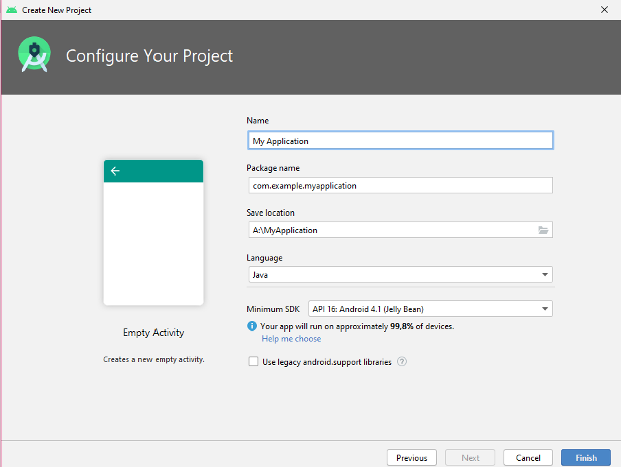
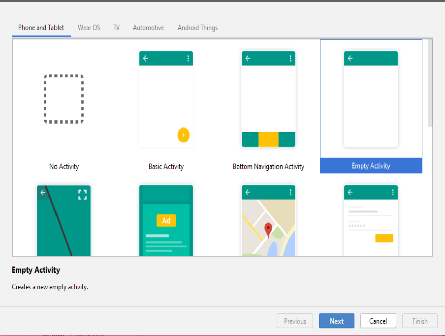

## Bài Tập Về Làm quen môi trường Android Studio và ứng dụng Android

-<a href= "https://ngocminhtran.com/2018/06/28/lap-trinh-android-dung-android-studio-3-x/"> Ứng Dụng Từ Bài</a>

### Yêu Cầu
A. MÔ TẢ VỀ Android Studio:
Môi trường
Tải và cài đặt Android Studio
Để kiểm tra các ứng dụng Android chúng ta có thể cài đặt và sử dụng máy ảo AVD (Android Virtual Device) có sẵn trong Android Studio hay cài đặt máy ảo tại Genymotion.
### Tạo ứng dụng đầu tiên
-<a href="https://github.com/tiendatmagic/helloworldandroid">Làm quen môi trường Android</a>

-<a href="https://www.youtube.com/watch?v=AVyxX9WsCVQ&feature=emb_logo">Link Hướng Dẫn nhiều hơn</a>

-Mở Android Studio

-Vào File > New > New Project

-Nhập tên ứng dụng (Hello World) trong mục Application Name, nhập vị trí lưu ứng dụng tại mục Project Location:

-Mặc định Android Studio dùng ngôn ngữ chính là Java

